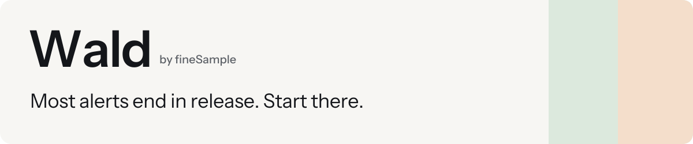
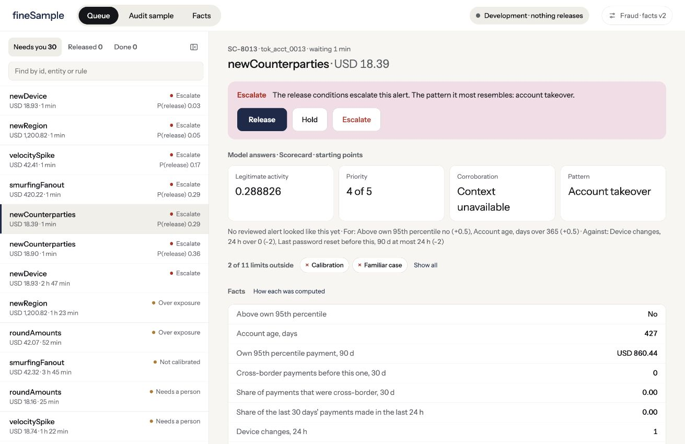
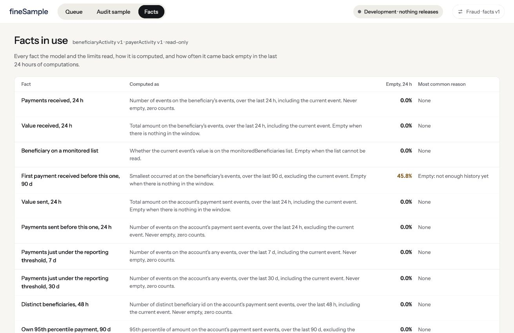

<!--
This is the public entry point for Wald's runtime preview and historical evaluator.
Keep unpublished candidates distinct from available releases and retain the
published benchmark's limits. Detailed contracts live in docs and ops.
-->

<p align="center">
  
</p>

<p align="center">
  <a href="tutorials/deployment.md">Try the runtime preview</a> ·
  <a href="tutorials/your-history.md">Assess your history</a> ·
  <a href="tutorials/warranty-pack.md">Try the warranty pack</a>
</p>

Wald helps teams get legitimate customers out of alert queues sooner. Send an
alert, review its facts in the Workbench, and keep the evidence behind the
decision. The local runtime also serves facts to your applications and learns
from independent outcomes.

**Release status:** `v0.2.0-beta.1` is a source candidate, not a published
release. Its source-free preview kit and tutorials are prepared here. The
published `v0.1.3` [historical evaluator](tutorials/getting-started.md) remains
available, with public examples and a separate verifier. Wald's product source
remains private.

## Meet the workbench



*The Workbench with synthetic data. The 0.2 preview connects it to a local API
and durable tenant store; the published 0.1 image remains a historical evaluator.*

Work the cases that need you, inspect how a fact was computed, and review a
blind sample before seeing Wald's answer.

<details>
<summary>See how facts are computed</summary>

<p></p>

<p><em>Synthetic development data. These are product screens, not benchmark results.</em></p>

</details>

## Your first 10 minutes

Download the runtime preview kit when `v0.2.0-beta.1` is published. From the
extracted `runtime-preview` directory, with Docker, Compose, Python 3.10 or
later, and `linux/amd64` support:

```sh
python3 wald-preview.py up --sample
python3 wald-preview.py credentials
```

Open the analyst sign-in link, review the sample alert, and inspect its
evidence. `stop` then `up` retains your work. The [walkthrough](tutorials/deployment.md)
explains setup and restart; [API integration](tutorials/developer-integration.md)
covers events, facts, outcomes, and learning. No private source or build is needed.

The preview runs one local Development tenant, with structured data and no
external write-back. Its [evaluation grant](EVALUATION-TERMS.md) includes
authorized customer data and an observational copy of a live feed. Local
reviews do not release payments or change a case manager. WorkOS setup,
the complete Merit Loop browser flow, narration, hosted operation, and
production qualification are outside the [preview contract](ops/release-0.2.md).

Prefer to start with history? These published experiments remain available:

| You want to | Start here |
| --- | --- |
| Run a published example and verify its answer | [Your first assessment](tutorials/getting-started.md) |
| Measure the opportunity in a prepared export | [Your own history](tutorials/your-history.md) |
| Use Wald for a decision beyond fraud | [The warranty pack](tutorials/warranty-pack.md) |

Allow about 10 minutes after the prerequisites and downloads. Preparing your
own export takes separate work. The tutorials identify the exact image for
each experiment, show the expected output, and explain what the result means.

## A result you can check

On the [published fraud fixture](https://github.com/finesample-lab/wald-benchmark/releases/tag/v0.1.3),
Wald assesses 600 held-out alerts:

| Would release | Later adverse outcomes among them | Kept with a person |
| ---: | ---: | ---: |
| 526 | 6 of 526: 1.1% (95% Wilson interval: 0.5% to 2.5%) | 74 |

**What we don't know yet.** fineSample wrote the synthetic history, evaluator,
and verifier. This is a reproducible historical result, not independent
validation, a competitive ranking, or a prediction for your queue. It does
not test the live learning loop. The interval describes this constructed
fixture, not another population. The report's illustrative 104 review hours
are 520 later-legitimate candidates multiplied by an assumed 12 minutes,
not measured savings.

[Read the fixture design](benchmark/public-assessment-v0.1/README.md) or
[run it on your own history](tutorials/your-history.md).

## Bring another decision

Fraud is the first application. The public
[warranty pack](packs/warranty-claim-triage-v0.1/README.md) asks whether a claim
can leave enhanced abuse review and enter ordinary warranty adjudication.
It does not decide warranty coverage or authorize payment.

Run its [400-claim composition benchmark](tutorials/warranty-pack.md) to see
Wald use customer history, product state, and facts across customers on the
same serial number. It proves composition and reproducibility, not production
warranty accuracy. The tutorial retains the proof's pinned 0.1.2 image.

To define your own decision, start with the
[pack-authoring guide](docs/PACK-AUTHORING.md),
[minimal complete pack](packs/minimal-v0.1/README.md), and
[format reference](docs/PACK-REFERENCE-v0.1.md).
The [authoring skill](skills/author-a-wald-pack/SKILL.md) follows those same
public contracts when you work with an agent.

## What's public

The benchmark source, synthetic fixture definitions, example packs, and
authoring kit are public. Wald's product source remains private.

The 0.2 preview adds the local runtime, Workbench, durable records, pack
installation, and existing API/CLI learning paths. The published 0.1 image
retains its historical-only scope and original terms.
[Read the release boundary](docs/RELEASE-BOUNDARY.md).

The benchmark source is [MIT-licensed](LICENSE). The
[minimal starter](packs/minimal-v0.1/LICENSE) and
[warranty pack](packs/warranty-claim-triage-v0.1/LICENSE) carry their own MIT
grants. Those licences do not apply to Wald's image, binary, unpublished packs,
or fineSample trademarks. Use of the 0.2 preview is governed by the
[evaluation terms](EVALUATION-TERMS.md).

[Published releases](https://github.com/finesample-lab/wald-benchmark/releases) · [Tutorials](tutorials/README.md) · [How releases are checked](docs/RELEASE-BOUNDARY.md#how-releases-are-checked)
